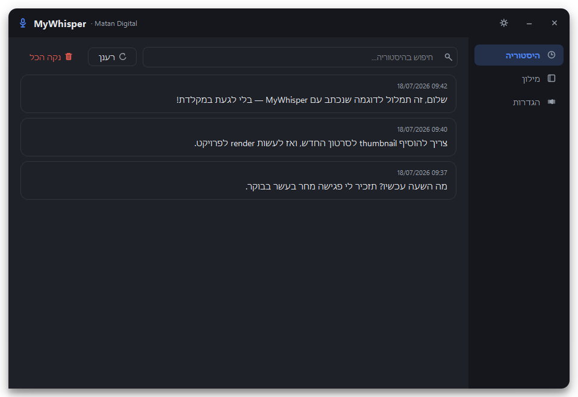
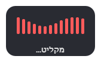
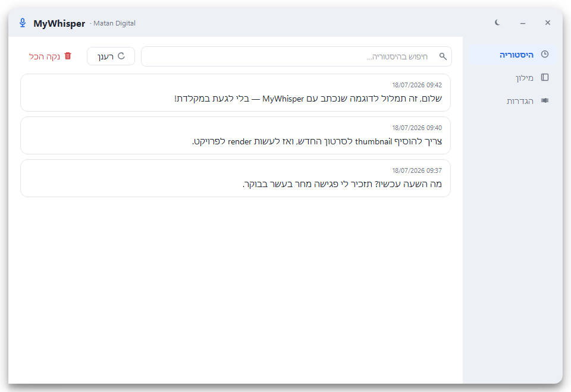
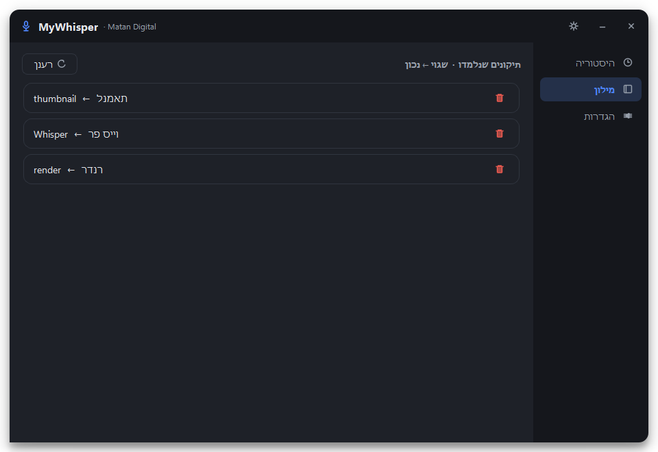
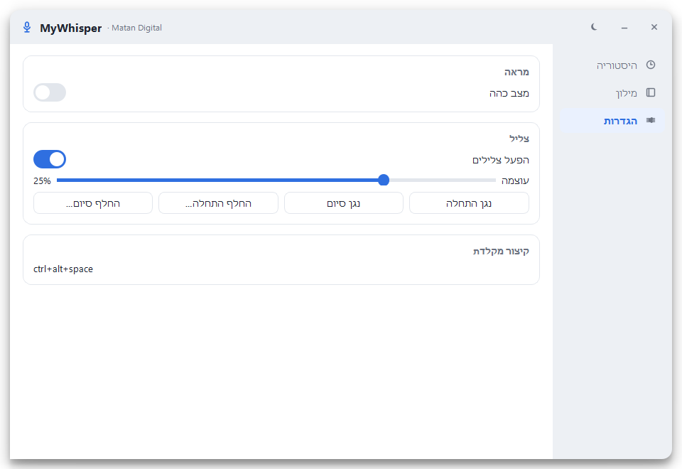

<div align="center">


# MyWhisper

**תמלול עברית מקומי לווינדוז 🎙️ — לוחצים קיצור, מדברים, והטקסט מודבק איפה שהסמן.**
**רץ כולו על ה-GPU שלך. בלי אינטרנט, בלי מנויים, בלי API.**

[](https://github.com/MatanCH2020/MyWhisper/releases)
[](#-%D7%93%D7%A8%D7%99%D7%A9%D7%95%D7%AA)
[](#)
[](#)
[](#)
[](#)

### 🌐 [דף הבית ← matanch2020.github.io/MyWhisper](https://matanch2020.github.io/MyWhisper/) · ⬇️ [הורדת מתקין](https://github.com/MatanCH2020/MyWhisper/releases/latest/download/MyWhisper-Setup.cmd)

<br>



<br>

*מחוון ההקלטה הצף — מופיע בראש המסך בזמן שמדברים:*



</div>

---

<div dir="rtl" align="right">

## ✨ מה מקבלים

| | |
|---|---|
| 🎤 **הכתבה בכל מקום** | קיצור מקלדת גלובלי — עובד בדפדפן, וורד, ווטסאפ, כל שדה טקסט |
| 🧠 **מודל עברית ייעודי** | `ivrit-ai/whisper-large-v3-turbo-ct2` עם פיסוק מלא (פסיק, סימן שאלה, קריאה) |
| ⚡ **מהיר ופרטי** | תמלול מקומי על ה-GPU — שום דבר לא עוזב את המחשב |
| 📚 **לומד אותך** | תיקנת מילה פעם אחת? מעכשיו היא תתומלל נכון אוטומטית |
| 🔤 **עברית + אנגלית** | מילים לועזיות נשארות LTR בתוך הטקסט העברי (בידוד BiDi) |
| 🎨 **ממשק מעוצב** | Qt עם RTL אמיתי, ערכות בהיר/כהה, היסטוריה עם חיפוש |

## ⚡ התקנה בפקודה אחת

פתח PowerShell והדבק:

```powershell
irm https://raw.githubusercontent.com/MatanCH2020/MyWhisper/main/install.ps1 | iex
```

הפקודה מתקינה Git ו-Python 3.12 אם חסרים, מורידה את הפרויקט ל-`%USERPROFILE%\MyWhisper`,
מתקינה את כל התלויות (כולל ספריות CUDA) ושמה קיצור **MyWhisper** על שולחן העבודה.
הרצה חוזרת של אותה פקודה = עדכון לגרסה האחרונה.

> בהרצה הראשונה יורד מודל התמלול (‎~1.5–3GB) — פעם אחת בלבד.

## 🎬 איך משתמשים

| מקש | פעולה |
|---|---|
| `Ctrl+Space` | התחלת הקלטה 🔴 (ביפ + מחוון בראש המסך) |
| `Ctrl+Space` שוב | עצירה → תמלול 🟡 → הטקסט מודבק לשדה הפעיל |
| `Esc` בזמן הקלטה | ביטול — ההקלטה נזרקת בלי תמלול |
| `X` על החלון | מזעור למגש — התוכנה ממשיכה להאזין ברקע |

יציאה מלאה: חץ למעלה ליד השעון ← קליק ימני על אייקון המיקרופון ← **יציאה**.
הקלטה שנשכחה פתוחה נעצרת ומתומללת אוטומטית אחרי 10 דקות.

## 🧠 התוכנה לומדת אותך

כל תמלול נשמר בלשונית **היסטוריה**. מילים שהמערכת לא מכירה (בעיקר מונחים לועזיים
שוויספר משבש) מסומנות **באדום** — לוחצים על המילה ובוחרים:

- **"שמור תיקון"** — מקלידים את הצורה הנכונה (מילה לועזית? באנגלית: `render`, `thumbnail`).
  מעכשיו התיקון חל אוטומטית על כל תמלול, והמודל מכוון להפיק אותה נכון מלכתחילה.
- **"המילה תקינה"** — נכנסת למילון האישי ולא תסומן שוב.

לשונית **מילון** מרכזת את כל מה שנלמד ומאפשרת למחוק תיקון.

## 🖼️ עוד מהאפליקציה

<details>
<summary><b>מצב בהיר, מילון והגדרות (לחץ להרחבה)</b></summary>
<br>

<div align="center">

*מצב בהיר:*



*המילון — תיקונים שנלמדו:*



*הגדרות — ערכת נושא, צלילים ועוצמה:*



</div>
</details>

## 📋 דרישות

- Windows 10/11 ומיקרופון
- כרטיס מסך NVIDIA (מומלץ, לתמלול מהיר) — **לא חובה**: במחשב בלי NVIDIA ההתקנה מדלגת
  אוטומטית על ספריות ה-CUDA (חוסכת ~2GB הורדה) והתמלול רץ על המעבד
- בהפעלה הראשונה יורד מודל התמלול (~2GB) ברקע — האייקון במגש כחול בזמן הטעינה
  והופך אפור כשהכול מוכן

## ⚙️ הגדרות מתקדמות

<details>
<summary><b><code>config.json</code> — כל המפתחות (לחץ להרחבה)</b></summary>
<br>

| שדה | משמעות |
|------|--------|
| `hotkey` | קיצור המקלדת (ברירת מחדל `ctrl+space`). ניתן לשנות ישירות מתוך **הגדרות ← קיצור מקלדת** — הקיצור מתעדכן מיד בלי הפעלה מחדש |
| `model` | מודל Whisper. ברירת מחדל: מודל עברית של ivrit.ai; חלופה מדויקת יותר: `large-v3` |
| `language` | שפת התמלול (`he`) |
| `device` | `cuda` ל-GPU או `cpu` |
| `compute_type` | `float16` ל-GPU, `int8` ל-CPU |
| `beam_size` | איכות מול מהירות (5 = איכותי) |
| `vad_filter` | סינון שקט אוטומטי |
| `restore_clipboard` | שחזור ה-clipboard המקורי אחרי ההדבקה |
| `clipboard_restore_delay` | שניות המתנה לפני שחזור ה-clipboard (הגדל לאפליקציות איטיות) |
| `max_record_seconds` | תקרת הקלטה — עצירה אוטומטית להקלטה שנשכחה (0 = כבוי) |
| `sounds` / `sound_volume` | צלילי התחלה/סיום ועוצמתם (0–1) |
| `highlight_unknown` | סימון אדום של מילים לא-מוכרות בהיסטוריה |
| `bidi_isolate` | שמירת כיווניות — אנגלית נשארת LTR בתוך עברית |
| `initial_prompt` | טקסט עברי שמכוון את המודל לפיסוק |
| `theme` | `dark` / `light` |

ההגדרות האישיות נשמרות ב-`config.json` (נוצר אוטומטית מ-`config.example.json`).

</details>

<details>
<summary><b>הפעלה ידנית ואוטומטית (לחץ להרחבה)</b></summary>
<br>

```powershell
# התקנה ידנית (מתוך תיקיית הפרויקט)
powershell -ExecutionPolicy Bypass -File setup.ps1

# בדיקת GPU + עברית (מקליט 4 שניות ומתמלל)
.\.venv\Scripts\python app\check_gpu.py

# הרצה עם קונסולה
.\.venv\Scripts\python app\main.py

# הרצה שקטה לרקע (בלי חלון קונסולה)
wscript run_mywishper.vbs

# הפעלה אוטומטית עם ווינדוז
powershell -ExecutionPolicy Bypass -File install_autostart.ps1

# בדיקות יחידה
.\.venv\Scripts\python -m unittest discover tests
```

</details>

## 🛠️ פתרון תקלות

<details>
<summary><b>לחץ להרחבה</b></summary>
<br>

כל האירועים נרשמים ל-`mywhisper.log` בתיקיית הפרויקט — זה המקום הראשון לבדוק.

- **`Ctrl+Space` לא עושה כלום מיד אחרי התקנה** — אם האייקון במגש כחול, מודל התמלול עדיין
  נטען/יורד (חד-פעמי, ~2GB). חכה שיהפוך אפור; לחיצה בינתיים תציג הודעה מסודרת.
- **הקיצור לא מגיב גם כשהאייקון אפור** — ייתכן שהצירוף תפוס בתוכנה אחרת, או שספריית הקיצורים
  דורשת הרשאות מנהל. פתח **הגדרות ← קיצור מקלדת** ובחר צירוף אחר (למשל `Ctrl+Alt+Space`),
  או לחץ **הפעל מחדש כמנהל** באותו מסך. הכל חי — בלי הפעלה מחדש ידנית.
- **התראת "מצב CPU" מהמגש** — טעינת ה-GPU נכשלה: בדוק דרייבר NVIDIA וש-`requirements-cuda.txt` הותקן (רץ אוטומטית ב-`setup.ps1` כשיש NVIDIA).
- **הקיצור לא עובד** — ספריית `keyboard` לפעמים דורשת הרצה **כמנהל**.
- **לא מודבק טקסט** — חלק מהאפליקציות חוסמות הזרקת קלט; נסה כמנהל, או שהטקסט עדיין ב-clipboard להדבקה ידנית (`Ctrl+V`).

</details>

---

<div align="center">

**MyWhisper** · נבנה על ידי [Matan Digital](https://github.com/MatanCH2020) 💙
מבוסס [faster-whisper](https://github.com/SYSTRAN/faster-whisper) + מודל העברית של [ivrit.ai](https://huggingface.co/ivrit-ai)

</div>

</div>
