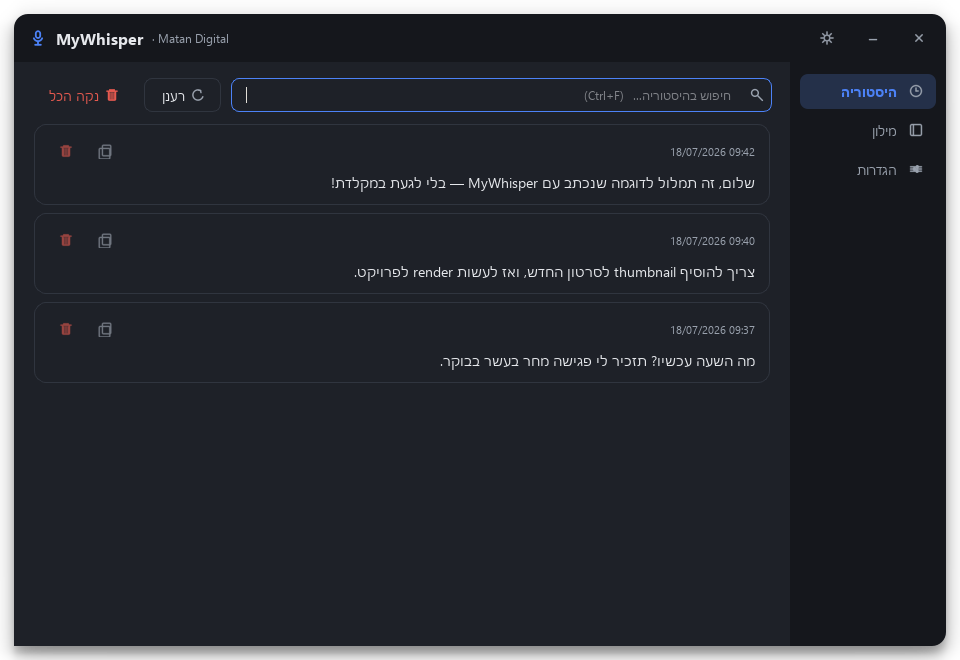
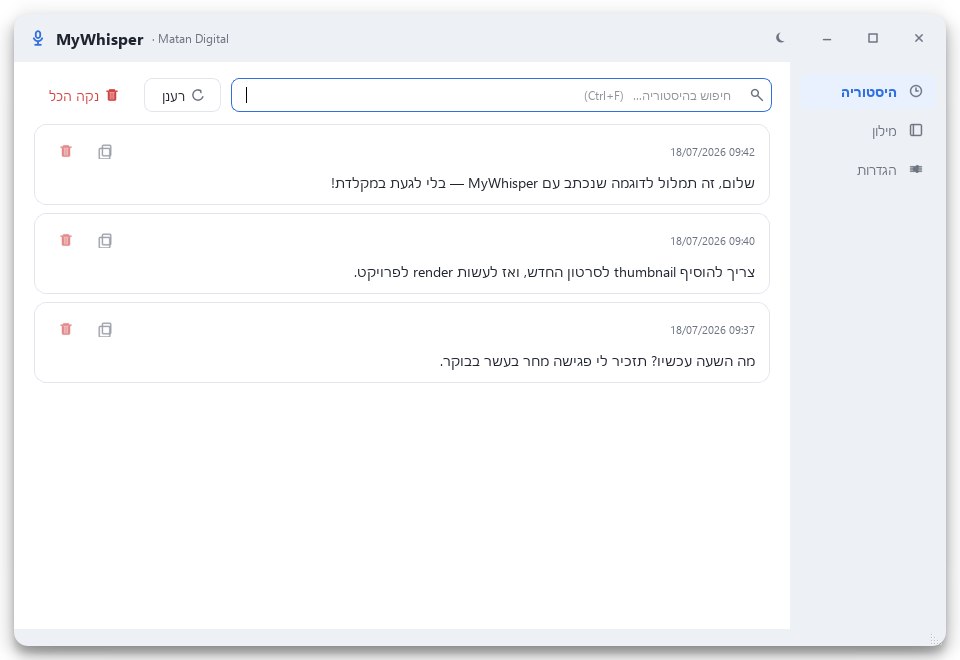
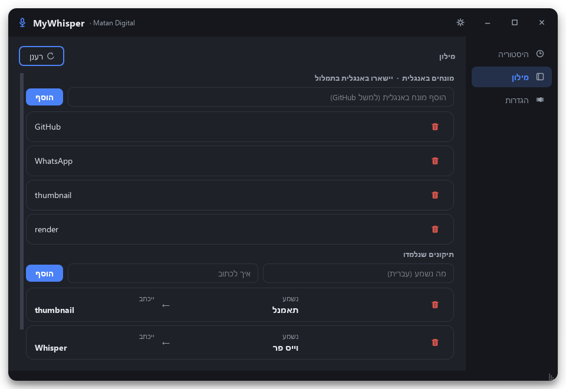
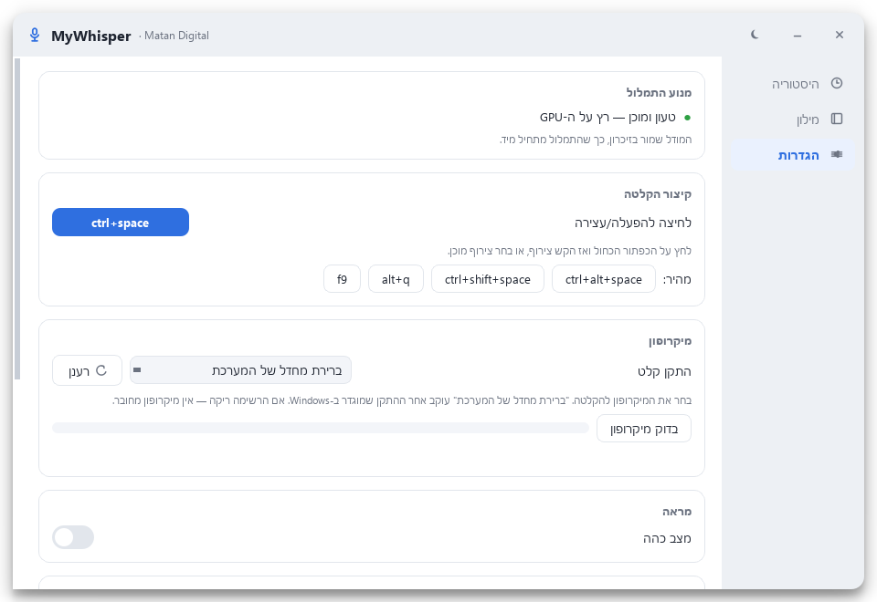

<div align="center">


# MyWhisper

**תמלול עברית מקומי לווינדוז 🎙️ — לוחצים קיצור, מדברים, והטקסט מודבק איפה שהסמן.**
**תמלול מקומי כברירת מחדל. עריכת טקסט בענן — לבחירתך.**

[](https://github.com/MatanCH2020/MyWhisper/releases)
[](#-%D7%93%D7%A8%D7%99%D7%A9%D7%95%D7%AA)
[](#)
[](#)
[](#)
[](#)

### 🌐 [דף הבית ← matanch2020.github.io/MyWhisper](https://matanch2020.github.io/MyWhisper/) · ⬇️ [הורדת מתקין](https://github.com/MatanCH2020/MyWhisper/releases/latest/download/MyWhisper-Setup.cmd)

<!-- release-version:start -->
**גרסה נוכחית: [v1.13.0](https://github.com/MatanCH2020/MyWhisper/releases/tag/v1.13.0)** · [היסטוריית העדכונים](CHANGELOG.md)
<!-- release-version:end -->

<br>



<br>

*מחוון ההקלטה הצף — מופיע בראש המסך בזמן שמדברים:*


</div>

---

<div dir="rtl" align="right">

## ✨ מה מקבלים

| | |
|---|---|
| 🎤 **הכתבה בכל מקום** | קיצור מקלדת גלובלי — עובד בדפדפן, וורד, ווטסאפ, כל שדה טקסט |
| 🧠 **מודל עברית ייעודי** | `ivrit-ai/whisper-large-v3-turbo-ct2` עם פיסוק מלא (פסיק, סימן שאלה, קריאה) |
| ⚡ **תמלול מקומי** | תמלול על ה-GPU ללא חשבון או בקשת ענן, כברירת מחדל |
| ✍️ **עריכת ChatGPT לבחירה** | ניקוי חזרות והיסוסים ושיפור ניסוח בחשבון אישי; כבוי עד להפעלה מפורשת |
| 📚 **לומד אותך** | תיקנת מילה פעם אחת? מעכשיו היא תתומלל נכון אוטומטית |
| 🔤 **עברית + אנגלית** | מילים לועזיות נשארות LTR בתוך הטקסט העברי (בידוד BiDi) |
| 📋 **היסטוריית העתקות** | כל טקסט/תמונה שהעתקת נשמר — ‎``Ctrl+` ``‎ פותח רשימה עם חיפוש. תצוגה מלאה לטקסט ולתמונות, הגדלה ושינוי גודל החלון. סיסמאות ממנהלי סיסמאות לא נשמרות |
| 🎨 **ממשק מעוצב** | Qt עם RTL אמיתי, ערכות בהיר/כהה, היסטוריה עם חיפוש |

## ⚡ התקנה בפקודה אחת

פתח PowerShell והדבק:

```powershell
irm https://raw.githubusercontent.com/MatanCH2020/MyWhisper/main/scripts/install.ps1 | iex
```

הפקודה מתקינה Git ו-Python 3.12 אם חסרים, מורידה את הפרויקט ל-`%USERPROFILE%\MyWhisper`,
מתקינה את כל התלויות (כולל ספריות CUDA), שמה קיצור **MyWhisper** על שולחן העבודה,
**ופותחת את האפליקציה מיד**. הרצה חוזרת מעדכנת לגרסה האחרונה שפורסמה, לאחר סגירת האפליקציה.
אפשר לעדכן גם דרך ההגדרות: הבדיקות המקדימות רצות לפני הסגירה האוטומטית.

> בהרצה הראשונה יורד מודל התמלול (‎~1.5–3GB) — פעם אחת בלבד.

### 🗑️ הסרה מלאה

רוצה להסיר את התוכנה? פתח PowerShell והדבק:

```powershell
irm https://raw.githubusercontent.com/MatanCH2020/MyWhisper/main/scripts/uninstall.ps1 | iex
```
הפקודה סוגרת את התוכנה, מוחקת את קיצורי הדרך ואת כל תיקיית ההתקנה מהמחשב.
אם חיברתם חשבון ChatGPT, בחרו **ניתוק** בהגדרות לפני ההסרה. אפשר לבטל את ההרשאה
גם ב-[הגדרות השימוש של ChatGPT](https://chatgpt.com/settings/usage).
קובץ רישום החשבונות המוצפן בתיקיית המשתמש נמצא מחוץ להתקנה ונשמר לחיבור חוזר;
ניתוק מסיר ממנו את האסימונים, אך משאיר את מזהי הרישום.

## 🎬 איך משתמשים

| מקש | פעולה |
|---|---|
| `Ctrl+Space` | התחלת הקלטה 🔴 (ביפ + מחוון בראש המסך) |
| `Ctrl+Space` שוב | עצירה → תמלול 🟡 → הטקסט מודבק לשדה הפעיל |
| `Esc` בזמן הקלטה | ביטול — ההקלטה נזרקת בלי תמלול |
| `X` על החלון | מזעור למגש — התוכנה ממשיכה להאזין ברקע |

יציאה מלאה: חץ למעלה ליד השעון ← קליק ימני על אייקון המיקרופון ← **יציאה**.
הקלטה שנשכחה פתוחה נעצרת ומתומללת אוטומטית אחרי 10 דקות.

חיווי ההקלטה מופיע למעלה במרכז **המסך שבו נמצא העכבר בתחילת ההקלטה**,
בחלונית קומפקטית עם מיקרופון, זמן הקלטה נפרד, גלי קול ורמז Esc לביטול.
הוא נשאר באותו מסך ובאותו גודל גם בזמן התמלול,
בלי לקחת את הפוקוס משדה ההקלדה. בכל הקלטה חדשה המסך נבחר מחדש.
אנימציית הכניסה מכבדת את הגדרת האנימציות של Windows.

## 🧠 התוכנה לומדת אותך

כל תמלול נשמר בלשונית **היסטוריה**. מילים שהמערכת לא מכירה (בעיקר מונחים לועזיים
שוויספר משבש) מסומנות **באדום** — לוחצים על המילה ובוחרים:

- **"שמור תיקון"** — מקלידים את הצורה הנכונה (מילה לועזית? באנגלית: `render`, `thumbnail`).
  מעכשיו התיקון חל אוטומטית על כל תמלול, והמודל מכוון להפיק אותה נכון מלכתחילה.
- **"המילה תקינה"** — נכנסת למילון האישי ולא תסומן שוב.

לשונית **מילון** מרכזת את כל מה שנלמד ומאפשרת למחוק תיקון.

## 🖼️ עוד מהאפליקציה

<details>
<summary><b>מצב בהיר, מילון והגדרות (לחץ להרחבה)</b></summary>
<br>

<div align="center">

*מצב בהיר:*



*המילון — תיקונים שנלמדו:*



*הגדרות — ערכת נושא, צלילים ועוצמה:*



</div>
</details>

## 📋 חלון היסטוריית ההעתקות

לחצו על ‎``Ctrl+` ``‎ לפתיחת החלון. קליק על פריט מציג את כל הטקסט באזור נגלל,
או תמונה גדולה עם כפתורי הגדלה, הקטנה והתאמה לחלון.
**העתק ללוח וסגור**, Enter מתוך הרשימה/החיפוש או לחיצה כפולה מעתיקים את הפריט ללוח;
לאחר מכן מדביקים אותו בשדה הרצוי עם Ctrl+V.
ניתן לגרור את הכותרת, לשנות גודל מהקצוות או מהידית, ולהגדיל למסך מלא.
כפתור X ו-Esc סוגרים את החלון. ניקוי כל ההעתקות דורש אישור.


המעבר בין בהיר לכהה מתבצע בתוך החלון הקיים. גם החלון הראשי ניתן להגדלה
באמצעות הכפתור בכותרת או גרירת הקצוות. עיבוד מודלי שפה באמצעות Ollama הוסר בגרסה 1.12.0.

## ✍️ שיפור הטקסט עם ChatGPT — תוספת לבחירה

התמלול המקומי עובד גם בלי חשבון או אינטרנט. התוספת **כבויה בהתקנה חדשה וגם בשדרוג**.
להפעלתה פתחו **הגדרות ← שיפור הטקסט עם ChatGPT**:

1. בחרו **דפדפן להתחברות** שבו כבר נכנסתם לחשבון (למשל Google Chrome), לחצו **Continue with ChatGPT** והשלימו אישור בדפדפן החיצוני שנבחר. כל משתמש מחבר את חשבונו האישי. MyWhisper אינו קורא את עוגיות הדפדפן או הסיסמאות.
2. בחרו מודל מהקטלוג של החשבון. **GPT-6 Luna** נבחר אם זמין, עם `reasoning.effort=none`; אחרת יש לבחור מודל. התחברות אינה מפעילה עריכה.
   בראש הכרטיס מופיע **מצב החיבור לחשבון** עם החשבון הפעיל. **מצב עריכת הטקסט** מופיע בנפרד: גם כשמחוברים, העריכה נשארת כבויה עד להפעלה מפורשת. בזמן התחברות יופיע „ממתין לאישור בדפדפן”; אם האישור לא התקבל, ההסבר נשאר בכרטיס גם אחרי שההודעה הזמנית נעלמת.
3. הפעילו **הפעל עריכה בענן** ואשרו: **טקסט ההכתבה יישלח ל־OpenAI לעריכה. האודיו והתמלול נשארים במחשב. השימוש כפוף לזכאות ולמכסת החשבון.** כלומר רק עותק הטקסט נשלח לעריכה; התמלול המקורי והאודיו מעובדים מקומית.
4. להחזרת מסלול מקומי בלבד, כבו את המתג. הכיבוי מפסיק עריכות וחידוש הרשאות ברקע מיד. „ניתוק” מוחק את ההרשאות המקומיות ומנסה לבטל גם את ההרשאה בשרת.

העריכה מנקה חזרות מקריות והיסוסים ומשפרת פיסוק וניסוח, תוך הנחיה לשמירת המשמעות,
השמות, המספרים, השלילה, האנגלית והחזרות המכוונות. היא אינה מבטיחה תיקון של כל טעות בזיהוי.
המסלול הוא **תמלול מקומי → מילון תיקונים → עריכת טקסט → הדבקה אחת**.
בכשל הרשאה, מכסה או חריגה מתקציב כולל של **שתי שניות נוספות**, משתמשים בתמלול המקומי,
מציגים חיווי קצר ומתעלמים מפלט חלקי או מאוחר. מהירות ואיכות בפועל תלויות בחשבון, ברשת ובמודל;
תקציב הזמן הוא גבול המתנה, ולא הבטחה שהעריכה תושלם.

בהיסטוריה אפשר לבחור **הצג מקור** כדי לראות את התמלול לאחר המילון ולפני OpenAI.
מעבר לחלון אחר בזמן העיבוד שומר את התוצאה בהיסטוריה ומציג הודעה, במקום להדביק בחלון האחר.
הרשאות OAuth נשמרות מוצפנות ב-Windows DPAPI, עבור משתמש Windows הנוכחי בלבד, ב-
`%LOCALAPPDATA%\MatanDigital\MyWhisper\chatgpt.dpapi`. הן אינן נשמרות בפרויקט או במתקין.
חשבון שאינו זכאי ממשיך בתמלול מקומי; **אין מעבר אוטומטי ל-API בתשלום**.
[ניהול שימוש והרשאות ב-ChatGPT](https://chatgpt.com/settings/usage) מאפשר לבדוק מכסה וניתוק.
בקשות העריכה משתמשות ב-Responses API עם `store=false` ו-`stream=true`; רק תשובה שהושלמה מתקבלת.

## 📋 דרישות

- Windows 10/11 ומיקרופון
- כרטיס מסך NVIDIA (מומלץ, לתמלול מהיר) — **לא חובה**: במחשב בלי NVIDIA ההתקנה מדלגת
  אוטומטית על ספריות ה-CUDA (חוסכת ~2GB הורדה) והתמלול רץ על המעבד
- בהפעלה הראשונה יורד מודל התמלול (~2GB) ברקע — האייקון במגש כחול בזמן הטעינה
  והופך אפור כשהכול מוכן

## ⚙️ הגדרות מתקדמות

<details>
<summary><b><code>config.json</code> — כל המפתחות (לחץ להרחבה)</b></summary>
<br>

| שדה | משמעות |
|------|--------|
| `hotkey` | קיצור המקלדת (ברירת מחדל `ctrl+space`). ניתן לשנות ישירות מתוך **הגדרות ← קיצור מקלדת** — הקיצור מתעדכן מיד בלי הפעלה מחדש |
| `clipboard_history` | שמירת כל מה שמעתיקים (ברירת מחדל `true`). כיבוי מבטל גם את המעקב וגם את הקיצור |
| `clipboard_hotkey` | הקיצור שפותח את רשימת ההעתקות (ברירת מחדל `` ctrl+` ``). שימו לב: ב-VS Code זה קיצור הטרמינל, ו-MyWhisper גובר עליו — שנו כאן אם זה מפריע |
| `clipboard_paused` | השהיית שמירת ההעתקות (נשלט גם ממסך ההגדרות) |
| `model` | מודל Whisper. ברירת מחדל: מודל עברית של ivrit.ai; חלופה מדויקת יותר: `large-v3` |
| `language` | שפת התמלול (`he`) |
| `device` | `cuda` ל-GPU או `cpu` |
| `compute_type` | `float16` ל-GPU, `int8` ל-CPU |
| `beam_size` | איכות מול מהירות ב-GPU (5 = איכותי) |
| `beam_size_cpu` | beam במצב CPU (1 = greedy, מהיר; מיושם אוטומטית כשרצים על מעבד) |
| `cpu_threads` | מספר ה-threads לתמלול CPU (0 = אוטומטי) |
| `idle_release_minutes` | שחרור המודל מהזיכרון אחרי N דקות ללא שימוש (0 = אף פעם) |
| `release_on_fullscreen` | שחרור המודל כשאפליקציית מסך-מלא (משחק) בחזית — למקסום ביצועים |
| `vad_filter` | סינון שקט אוטומטי |
| `input_device` | שם המיקרופון להקלטה (`""` = ברירת מחדל של המערכת). ניתן לבחור מ**הגדרות ← מיקרופון** |
| `restore_clipboard` | שחזור ה-clipboard המקורי אחרי ההדבקה |
| `clipboard_restore_delay` | שניות המתנה לפני שחזור ה-clipboard (הגדל לאפליקציות איטיות) |
| `max_record_seconds` | תקרת הקלטה — עצירה אוטומטית להקלטה שנשכחה (0 = כבוי) |
| `sounds` / `sound_volume` | צלילי התחלה/סיום ועוצמתם (0–1) |
| `highlight_unknown` | סימון אדום של מילים לא-מוכרות בהיסטוריה |
| `bidi_isolate` | שמירת כיווניות — אנגלית נשארת LTR בתוך עברית |
| `glossary_prompt` | שילוב המונחים האישיים באנגלית בהכוונת מודל התמלול |
| `initial_prompt` | טקסט עברי שמכוון את המודל לפיסוק |
| `theme` | `dark` / `light` |
| `chatgpt_enabled` | עריכת טקסט בענן לאחר התמלול המקומי; ברירת מחדל `false`, גם בשדרוג. התחברות אינה מפעילה את התוספת |
| `chatgpt_model` | מזהה המודל מהקטלוג של החשבון המחובר. GPT-6 Luna נבחר אם זמין; אחרת יש לבחור מודל לפני הפעלה |
| `chatgpt_browser` | דפדפן חיצוני להתחברות ולניהול שימוש: `system` (ברירת מחדל), `chrome`, `edge`, `firefox`, `brave`, `opera` או `vivaldi`. ניתן לבחור דפדפן מותקן במסך ההגדרות |

ההגדרות האישיות נשמרות ב-`config.json` (נוצר אוטומטית מ-`config.example.json`).

</details>

<details>
<summary><b>הפעלה ידנית ואוטומטית (לחץ להרחבה)</b></summary>
<br>

```powershell
# התקנה ידנית (מתוך תיקיית הפרויקט)
powershell -ExecutionPolicy Bypass -File scripts\setup.ps1

# בדיקת GPU + עברית (מקליט 4 שניות ומתמלל)
.\.venv\Scripts\python app\check_gpu.py

# הרצה עם קונסולה
.\.venv\Scripts\python app\main.py

# הרצה שקטה לרקע (בלי חלון קונסולה)
wscript scripts\run_mywishper.vbs

# הפעלה אוטומטית עם ווינדוז
powershell -ExecutionPolicy Bypass -File scripts\install_autostart.ps1

# בדיקות יחידה
.\.venv\Scripts\python -m unittest discover tests
```

הגדרת ההפעלה האוטומטית היא למשתמש הנוכחי בלבד. לאחר כניסה ל־Windows,
MyWhisper עולה ברקע ללא החלון הראשי ומציג הודעה קצרה כשהוא מוכן להכתבה.
פתיחה ידנית ממשיכה להציג את החלון. להרצה ברקע ידנית:
`wscript scripts\run_mywishper.vbs --startup`.
הרצה חוזרת של סקריפט ההפעלה מעדכנת ומפעילה את אותו קיצור; לביטול ניתן
להשבית את MyWhisper באפליקציות האתחול של Windows או למחוק את `MyWhisper.lnk`
מתיקיית `shell:startup`.

</details>

## 🛠️ פתרון תקלות

<details>
<summary><b>לחץ להרחבה</b></summary>
<br>

כל האירועים נרשמים ל-`mywhisper.log` בתיקיית הפרויקט — זה המקום הראשון לבדוק.

- **`Ctrl+Space` לא עושה כלום מיד אחרי התקנה** — אם האייקון במגש כחול, מודל התמלול עדיין
  נטען/יורד (חד-פעמי, ~2GB). חכה שיהפוך אפור; לחיצה בינתיים תציג הודעה מסודרת.
- **הקיצור לא מגיב גם כשהאייקון אפור** — כנראה הצירוף תפוס בתוכנה אחרת (הקיצור משתמש
  ב-`RegisterHotKey` של Windows, שנכשל אם הצירוף כבר תפוס — ואז תופיע התראה מהמגש).
  פתח **הגדרות ← קיצור מקלדת** ובחר צירוף אחר (למשל `Ctrl+Alt+Space`) — מתעדכן מיד.
- **התראת "מצב CPU" מהמגש** — טעינת ה-GPU נכשלה: בדוק דרייבר NVIDIA וש-`requirements-cuda.txt` הותקן (רץ אוטומטית ב-`setup.ps1` כשיש NVIDIA).
- **הקיצור לא עובד** — הצירוף כנראה תפוס בתוכנה אחרת. שנה אותו ב**הגדרות ← קיצור מקלדת**.
- **לא מודבק טקסט** — חלק מהאפליקציות חוסמות הזרקת קלט; הטקסט עדיין ב-clipboard להדבקה ידנית (`Ctrl+V`).

</details>

---

<div align="center">

**MyWhisper** · נבנה על ידי [Matan Digital](https://github.com/MatanCH2020) 💙
מבוסס [faster-whisper](https://github.com/SYSTRAN/faster-whisper) + מודל העברית של [ivrit.ai](https://huggingface.co/ivrit-ai)

</div>

</div>


## יציבות, גיבוי ובדיקות למפתחים

- התקנה ועדכון בוחרים תג גרסה שפורסם ב-GitHub. עדכון נעצר אם יש שינויי קוד מקומיים, כולל קבצים שטרם נוספו ל-Git. אין איפוס כוחני של התיקייה.
- לפני החלפת גרסה נשמרים ארכיון קוד ועותק של סביבת Python תחת `.update-backups`. כשל בהתקנה או בבדיקת ההפעלה מחזיר את הגרסה הקודמת ואת הסביבה. הגיבויים נשמרים גם אחרי הצלחה; יש לפנות מקום של כשני עותקי הסביבה ועוד 2GB. אחרי אימות הגרסה אפשר למחוק גיבויים ישנים באופן ידני.
- כשל כתיבה מוצג בהודעה. קובץ JSON פגום מגובה בקובץ `*.corrupt-*.bak` לפני התאוששות. הגיבויים מכילים מידע אישי ונשארים מקומיים; הם מוחרגים מ-Git.
- שחזור הלוח מתבצע רק אם תוכנו לא השתנה מאז ההדבקה. נתמכים טקסט, DIB/DIBV5, רשימות קבצים, HTML, RTF, PNG וסימוני מנהלי סיסמאות. פורמטים פרטיים אחרים של יישומים אינם משוחזרים. תמונת מצב מעל 64MB לא תוחלף; התמלול נשאר בהיסטוריה.
- תוכן התמלול אינו נכתב ללוג. ההיסטוריה והמילונים נשמרים מקומית כרגיל.
- עמודי הממשק נמצאים ב-`app/ui_pages`; `app/ui.py` נשאר מעטפת הבקר, החלון והרכיבים המשותפים. הממשק ממשיך לקבל את פעולות המנוע באמצעות callbacks.
- קובצי `requirements*.in` מתארים תלויות ישירות; `requirements*.txt` נועלים את התלויות הישירות והעקיפות שנבדקו ב-Windows x64 ו-Python 3.12. עדכון שלהן דורש בדיקת התקנה נקייה ובדיקת GPU לפני הפצה.

```powershell
.\.venv\Scripts\python -m unittest discover tests
.\.venv\Scripts\python -m pip check
.\.venv\Scripts\python scripts\verify_install.py
```

הבדיקה האחרונה טוענת את המודולים ואת Qt ללא הקלטה, רישום קיצורי מקלדת או הורדת מודל. CI מריץ התקנה נקייה ובדיקות על Windows עם Python 3.12; הוא אינו מאמת תמלול על GPU.

לפני פרסום גרסה: לבדוק הכתבה אמיתית בעברית ובשילוב אנגלית על GPU ועל CPU, הדבקה ב-Notepad ובדפדפן, ניתוק וחיבור מיקרופון, Esc, עצירה אוטומטית, לחיצות מהירות, מסך מלא ועבודה ללא רשת כשהמודל כבר נמצא במטמון. יש לוודא שמספר הגרסה, השינויים ותג ה-GitHub תואמים.

נוהל הסנכרון והפרסום הקבוע נמצא ב-[RELEASING.md](RELEASING.md). לפני commit מריצים
`.\.venv\Scripts\python scripts\sync_release.py` לעדכון פרטי הגרסה באתר ובמדריך.
CI מריץ את אותה בדיקה עם `--check` ונכשל אם המידע אינו מסונכרן או אם קוד האפליקציה השתנה בלי מספר גרסה חדש.
